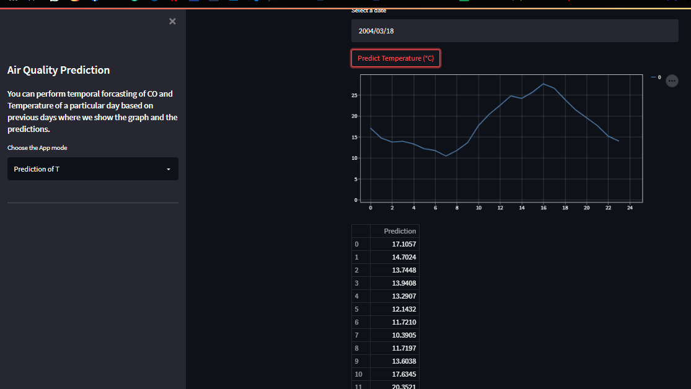

# air_quality_predict

# Blue Sky Under
- A web app which takes a date as input from the user and uses historical forecasting to predict and plot CO density(mg/m^3) and Temperature(C) of that day over 24 hours.
- Gives you a line plot as well as a table of values for a specific day's prediction
- Used various techniques of time series forecasting in the model .
- Used streamlit to create the frontend and hosted it on Heroku.

## Front-End Snap

## Dependencies

The python version used in this project is 3.9.x.
* Python Libraries used in project:
    1. streamlit 
    2. darts
    3. numpy
    4. datetime
    5. pickle
    6. pandas
    7. matplotlib
  

## Executing program

After installing all the dependencies, clone the repository into your local drive and then execute the App.py file and the web app will be shown on your local device.

